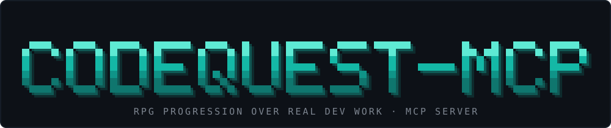

<p align="center">
  
</p>

<h1 align="center">CodeQuest MCP</h1>

<p align="center">
  <a href="#installation">Install</a> ·
  <a href="#quick-start">Quick start</a> ·
  <a href="#how-it-works">How it works</a> ·
  <a href="#tools">Tools</a> ·
  <a href="#in-the-terminal">Terminal</a> ·
  <a href="llms-install.md">For AI agents</a> ·
  <a href="CONTRIBUTING.md">Contributing</a> ·
  <a href="SECURITY.md">Security</a>
</p>

<p align="center">
  <a href="LICENSE"></a>
  
  
</p>

<p align="center">
  <a href="README.md"></a>
  <a href="README.ru.md"></a>
</p>

An MCP server that **turns real development work into an RPG**. Every project gets its own level (1-50), XP, nine
stats and a board of quests that are generated from the actual state of the code: dead files, untested modules,
hardcoded secrets, missing error handling, TODOs. You fix the code, the server checks it by machine, and only then
you get the XP.

There is no LLM inside. The scanner, the quests, the XP and the checks are deterministic, so the same project
always gives the same board, and the AI's word is never enough to earn a reward.

Tested on Windows and Node 22. Other operating systems have not been tested.

| | |
|---|---|
| **Quests from real code** | The scanner reads the project (JS/TS and Python, shops and Telegram bots get their own rules) and turns findings into quests: Easy, Medium, Hard and Epic with subtasks. |
| **XP only after a check** | A quest is closed when the scanner no longer finds the problem. If the project's own tests and build also ran green, the reward is full; otherwise it is 80%, and a green run pays the rest once. |
| **Per-project progress** | Level, XP, journal and quests live in a separate folder per project. Switching projects switches the hero. |
| **Stats, classes, bosses** | Nine stats (Architecture, Testing, Security, Performance, Clean Code, Reliability, Maintainability, Bugs, Tech Debt), six classes with hybrids, bosses made of clusters of problems, 12 achievements. |
| **History** | A timeline of milestones by day: quests done, bosses defeated, achievements, level-ups. |
| **Russian and English** | HUD, board, quests and reasons switch with one setting. |
| **Safe by design** | The scanner only reads files. Your project's commands run only after you allow them for that project. |

## Installation

You need Node.js 22.12+ and Git. The server is not published to npm yet: it is built from the repository.

```bash
git clone https://github.com/aleks-fw/rpg-game-code.git
cd rpg-game-code
npm ci
npm run build
```

### Connect to Claude Code

```bash
claude mcp add codequest --scope user --env CODEQUEST_HOME=<data folder> -- node "<path>/rpg-game-code/dist/cli/index.js" mcp
```

`CODEQUEST_HOME` is where progress is stored (default `~/.codequest`). Restart the MCP server after every rebuild.

### Connect to other clients (Claude Desktop, Cursor, ...)

```json
{
  "mcpServers": {
    "codequest": {
      "command": "node",
      "args": ["<path>/rpg-game-code/dist/cli/index.js", "mcp"],
      "env": { "CODEQUEST_HOME": "<data folder>" }
    }
  }
}
```

### If you are an AI agent

Read [llms-install.md](llms-install.md): it has the steps and the confirmations to ask the user for.

## Quick start

Open your project in an AI client with CodeQuest connected and talk to it in plain words:

1. **"Show the quest board"**: the server scans the project and lists quests with difficulty and XP.
2. **"Take quest 2"** (or pick one on the board): the quest goes into work, the AI reads its files and fixes the code.
3. **"Check the quest"**: the server re-scans. If the problem is gone, you get XP, the level and stats update. If not,
   it says which condition still fails.
4. **"Allow commands"** (optional): lets the check also run the project's tests and build, so the quest pays 100%
   instead of 80%.
5. Look around: **"my level"**, **"history for the week"**, **"achievements"**, **"bosses"**.

No AI client? The same loop works in the terminal: `node dist/cli/index.js board`, move with the arrow keys, take a
quest, fix the code, press `V` to check (see [In the terminal](#in-the-terminal)).

## How it works

```
 scan project ──► findings ──► quests ──► you fix the code ──► verify ──► XP, level, stats
      ▲                                                            │
      └──────────────────── next analysis ◄────────────────────────┘
```

1. **Analysis.** The scanner builds a snapshot: findings with stable IDs, facts about the project (files, tests,
   scripts). An unchanged project is not scanned again.
2. **Quests.** Findings of one kind become one quest; related ones become an epic with subtasks. A quest has a
   difficulty, a category and the conditions that close it.
3. **Verification.** `verify_quest_completion` re-checks the conditions. A quest counts as done only if the
   findings are really gone. Each finding is paid once.
4. **Progress.** XP: Easy 100, Medium 300, Hard 500, Epic 1200, reduced by 5% per level. Level = `XP / 500 + 1`, up
   to 50. Formulas are in [docs/formulas.md](docs/formulas.md).

Project commands (tests, build) run only after `set_project_settings` with `allow_commands`, and only when you ask for
a check, never in the background.

## Tools

| Tool | What it does |
|---|---|
| `get_project_state` | Everything at a glance: level, XP, stats, class, open quests. |
| `get_player_level` | Level, title, XP to the next level. |
| `get_project_stats` | The nine stats with the reasons behind them. |
| `get_active_quests` | The quest board of the project. |
| `get_quest_details` | Conditions, subtasks and files of one quest. |
| `start_quest` | Take a quest into work. |
| `verify_quest_completion` | The "Check quest" button: re-check one quest or all open ones and pay the XP. |
| `refresh_project_analysis` | Scan the project again. |
| `get_project_history` | Milestones by day (1-365 days). |
| `get_achievements` | The 12 achievements and your progress. |
| `get_project_bosses` | Active bosses with HP and the quests that hit them, and defeated ones. |
| `set_project_settings` | Allow or forbid running the project's own commands. |
| `set_language` | `ru` or `en`. |

Prompts for the `/` menu of clients that show them: `quest_board`, `verify_quest`, `work_on_quest`.

## In the terminal

The same engine works without an AI client:

```bash
node dist/cli/index.js hud            # level, XP, stats
node dist/cli/index.js hud --minimal  # one line: ⚔️ LVL 3 · CODER · 1,450 XP
node dist/cli/index.js board          # full-screen quest board: choose, take, check
node dist/cli/index.js verify [quest] # the "Check quest" button
node dist/cli/index.js refresh        # scan and show what changed
node dist/cli/index.js lang ru        # switch the language
```

All commands take `--path <project>` and `--home <data folder>`.

**A board that does not get in the way.** Run `board` in its own terminal tab, for example with a VS Code task that
starts when the folder opens and does not take the keyboard focus, so you can keep working in the other terminal.
The one-line `hud --minimal` fits the Claude Code status line (`statusLine` in `settings.json`).

## Stats, classes and bosses

- **Stats.** Six health stats fall with open findings (a big project forgives more), Testing grows with coverage and
  green test runs, Bugs and Tech Debt are plain counters.
- **Classes.** Your class follows the kind of work you have verified: six classes and hybrids, with a star on the
  stat that defines it.
- **Bosses.** Seven themes (Dark Forest of untested modules, Graveyard of dead files, Clone Army, Secret Leak, Blind
  Spots, Breach, TODO Swamp). A cluster of findings spawns a boss; fixing them all defeats it. A rule that failed to
  run never counts as a victory.

## Safety

- The scanner reads the project and never writes to it.
- The project's commands run only with your permission for that project, with a timeout and low priority.
- Progress is stored outside the project, in `CODEQUEST_HOME`; a lock keeps two sessions from corrupting it.
- Secrets found by the scanner are masked in the output.

## Known limitations

- Not published to npm; built from source.
- Tested on Windows and Node 22 only.
- The scanner knows JS/TS and Python; other languages give a smaller board.
- Commands of foreign projects (`npm test`, `pytest`) have been exercised on test projects only.
- Error messages from the scanner's own rules and the commands' output stay in English.

## Roadmap

- Dashboard, project map and analytics (phase 3).
- A Builder and a Researcher class, when there are quest categories for them.
- Publishing to npm.

## Development

```bash
npm run check   # typecheck + lint + tests (about 4 minutes)
npm run build
```

The plan and the decisions are in [ПЛАН.md](ПЛАН.md) (Russian), the design in `docs/superpowers/specs/`, the
acceptance report in [docs/acceptance-report.md](docs/acceptance-report.md). The banner is generated by
`node scripts/make-banner.mjs`.

## License

[MIT](LICENSE)
